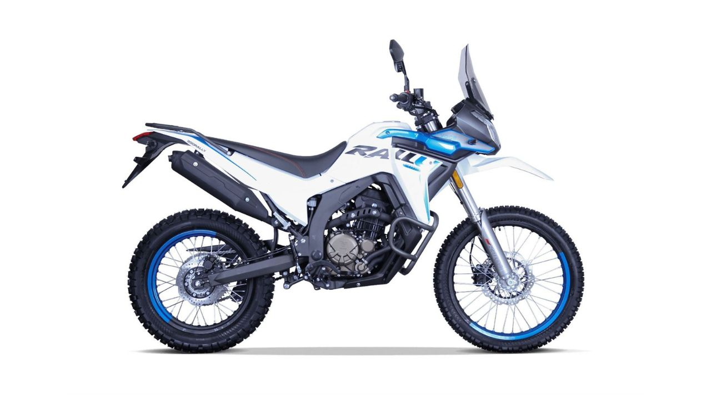

# 📊 ANÁLISIS PROFUNDO: SISTEMA DE CATEGORÍAS Y PRODUCTOS
## LlévateloExpress - Estudio Completo de Arquitectura e Integración

### 📅 **INFORMACIÓN DEL ANÁLISIS**
- **Fecha**: 2 de Junio 2025
- **Sistema**: LlévateloExpress v1.0
- **Enfoque**: Backend Django + Frontend HTML/JS + Admin Panel
- **Estado**: Completamente funcional en producción

---

## 🏗️ **1. ARQUITECTURA DEL SISTEMA**

### **Componentes Principales**
```
┌─────────────────────────────────────────────────────────┐
│                    ARQUITECTURA MVC                    │
├─────────────────────────────────────────────────────────┤
│                                                         │
│  🌐 FRONTEND (Presentación)                           │
│  ├── HTML Templates (catalogo.html, detalle-producto) │
│  ├── JavaScript (products.js, main.js)                │
│  └── CSS Styling (Bootstrap + Custom)                 │
│                                                         │
│  🔗 API REST (Comunicación)                           │
│  ├── /api/products/categories/                        │
│  ├── /api/products/products/                          │
│  ├── /api/products/featured-products/                 │
│  └── /api/products/products-by-category/<slug>/       │
│                                                         │
│  ⚙️  BACKEND (Lógica de Negocio)                       │
│  ├── Models (Category, Product)                       │
│  ├── Views (CategoryViewSet, ProductViewSet)          │
│  ├── Serializers (ProductListSerializer, Detail)     │
│  └── Admin (CategoryAdmin, ProductAdmin)              │
│                                                         │
│  🗄️  BASE DE DATOS (PostgreSQL)                        │
│  ├── products_category                                │
│  ├── products_product                                 │
│  └── Media Files (ImageField storage)                 │
│                                                         │
└─────────────────────────────────────────────────────────┘
```

---

## 🗂️ **2. MODELOS DE BASE DE DATOS**

### **2.1 Modelo Category**
```python
class Category(models.Model):
    id = models.CharField(max_length=50, primary_key=True)  # "motocicletas"
    name = models.CharField(max_length=100)                 # "Motocicletas"
    slug = models.SlugField(unique=True)                    # "motocicletas"
    description = models.TextField()                        # Descripción detallada
    icon = models.CharField(max_length=50)                  # "fa-motorcycle"
```

**💾 Datos Actuales en Producción:**
| ID | Nombre | Slug | Descripción | Icono | Productos |
|----|----|-----|-------------|--------|-----------|
| `motocicletas` | Motocicletas | motocicletas | Desde modelos económicos hasta deportivos de alta gama | fa-motorcycle | **7** |
| `vehiculos` | Vehículos | vehiculos | Autos, camionetas y vehículos comerciales | fa-car | **0** |
| `maquinaria` | Maquinaria Agrícola | maquinaria-agricola | Tractores y equipos para optimizar producción | fa-tractor | **0** |
| `camiones` | Camiones | camiones | Camiones de carga, transporte y distribución | fa-truck | **0** |
| `equipos` | Maquinaria y Equipos | maquinaria-equipos | Equipamiento especializado industria y comercio | fa-cogs | **0** |

### **2.2 Modelo Product**
```python
class Product(models.Model):
    # Información Básica
    name = models.CharField(max_length=200)
    category = models.ForeignKey(Category, on_delete=models.CASCADE, related_name='products')
    brand = models.CharField(max_length=100)
    price = models.DecimalField(max_digits=10, decimal_places=2)
    image = models.ImageField(upload_to='products/')
    description = models.TextField()
    
    # Características y Especificaciones (JSON)
    features = models.JSONField()           # Lista de características destacadas
    specs_general = models.JSONField()      # Especificaciones generales
    specs_engine = models.JSONField()       # Especificaciones del motor
    specs_comfort = models.JSONField()      # Especificaciones de confort
    specs_safety = models.JSONField()       # Especificaciones de seguridad
    
    # Gestión de Inventario
    stock = models.IntegerField(default=0)
    featured = models.BooleanField(default=False)
    
    # Auditoría
    created_at = models.DateTimeField(auto_now_add=True)
    updated_at = models.DateTimeField(auto_now=True)
```

**💾 Productos Actuales:**
- **7 productos** de motocicletas (todos destacados)
- **Marcas**: Voge (4 productos), Suzuki (3 productos)
- **Rango de precios**: $2,200 - $8,500 USD
- **Stock total**: 51 unidades disponibles

---

## 🔌 **3. API BACKEND (Django REST Framework)**

### **3.1 Endpoints Disponibles**
```python
# Categorías
GET /api/products/categories/           # Lista todas las categorías
GET /api/products/categories/{id}/      # Detalle de categoría específica

# Productos
GET /api/products/products/                    # Lista todos los productos
GET /api/products/products/{id}/               # Detalle de producto específico
GET /api/products/featured-products/           # Solo productos destacados
GET /api/products/products-by-category/{slug}/ # Productos por categoría
```

### **3.2 Serializers Estructurados**

#### **CategorySerializer**
```json
{
  "id": "motocicletas",
  "name": "Motocicletas",
  "slug": "motocicletas",
  "description": "Desde modelos económicos hasta deportivos de alta gama.",
  "icon": "fa-motorcycle"
}
```

#### **ProductListSerializer** (Optimizado para listados)
```json
{
  "id": 1,
  "name": "Voge Rally 300",
  "category": "motocicletas",
  "category_name": "Motocicletas",
  "brand": "Voge",
  "price": "4500.00",
  "image": "https://llevateloexpress.com/media/products/300.jpg",
  "featured": true
}
```

#### **ProductDetailSerializer** (Completo para detalles)
```json
{
  "id": 1,
  "name": "Voge Rally 300",
  "category": "motocicletas",
  "category_name": "Motocicletas",
  "brand": "Voge",
  "price": "4500.00",
  "image": "https://llevateloexpress.com/media/products/300.jpg",
  "description": "La Voge Rally 300 es una motocicleta de aventura ligera...",
  "features": [
    "Motor monocilíndrico de 292cc refrigerado por líquido",
    "Potencia máxima de 29 HP a 8500 rpm",
    "Transmisión de 6 velocidades",
    // ... más características
  ],
  "specs_general": [
    {"label": "Marca", "value": "Voge"},
    {"label": "Modelo", "value": "Rally 300"},
    {"label": "Año", "value": "2023"},
    // ... más especificaciones
  ],
  "specs_engine": [ /* ... */ ],
  "specs_comfort": [ /* ... */ ],
  "specs_safety": [ /* ... */ ],
  "stock": 8,
  "featured": true
}
```

### **3.3 ViewSets y Vistas**
```python
# ReadOnly ViewSets para operaciones CRUD básicas
class CategoryViewSet(viewsets.ReadOnlyModelViewSet)
class ProductViewSet(viewsets.ReadOnlyModelViewSet)

# Vistas especializadas para casos específicos
class FeaturedProductsView(generics.ListAPIView)      # Productos destacados
class ProductsByCategoryView(generics.ListAPIView)    # Filtrado por categoría
```

---

## 🎛️ **4. ADMIN DE DJANGO**

### **4.1 CategoryAdmin - Gestión de Categorías**
```python
@admin.register(Category)
class CategoryAdmin(admin.ModelAdmin):
    list_display = ('name', 'id', 'icon_display', 'product_count')
    search_fields = ('name', 'id')
    prepopulated_fields = {'slug': ('name',)}  # Auto-genera slug
```

**Características:**
- ✅ **Vista de iconos**: Renderiza iconos FontAwesome visualmente
- ✅ **Contador de productos**: Muestra cuántos productos tiene cada categoría
- ✅ **Búsqueda**: Por nombre e ID de categoría
- ✅ **Slug automático**: Se genera desde el nombre

### **4.2 ProductAdmin - Gestión de Productos**
```python
@admin.register(Product)
class ProductAdmin(admin.ModelAdmin):
    list_display = ('name', 'category', 'brand', 'price', 'stock', 'featured', 'thumbnail')
    list_filter = ('category', 'brand', 'featured')
    search_fields = ('name', 'description')
    list_editable = ('price', 'stock', 'featured')  # Edición inline
```

**Funcionalidades Avanzadas:**
- ✅ **Fieldsets organizados**: Información básica, características, especificaciones, inventario
- ✅ **Vista previa de imágenes**: Thumbnails en lista y vista completa en detalle
- ✅ **Edición inline**: Precio, stock y featured editables desde la lista
- ✅ **Filtros múltiples**: Por categoría, marca y estado destacado
- ✅ **Especificaciones colapsibles**: Specs organizadas en sección plegable

---

## 🌐 **5. FRONTEND - INTERFAZ DE USUARIO**

### **5.1 Estructura de Archivos Frontend**
```
📁 Frontend Files
├── 📄 catalogo.html           # Página principal de catálogo
├── 📄 detalle-producto.html   # Vista detallada de producto
├── 📄 js/products.js          # Lógica de productos (actualmente estático)
├── 📄 js/main.js              # Funcionalidad general
└── 📄 css/styles.css          # Estilos personalizados
```

### **5.2 Página de Catálogo (catalogo.html)**

#### **Componentes Principales:**
1. **🔍 Sistema de Filtros**
   - ✅ Filtro por categoría (radio buttons)
   - ✅ Filtro por marca (checkboxes múltiples)
   - ✅ Slider de rango de precio ($0 - $35,000)
   - ✅ Botón "Aplicar Filtros"

2. **📊 Sistema de Ordenamiento**
   - ✅ Por precio (ascendente/descendente)
   - ✅ Por nombre (A-Z / Z-A)
   - ✅ Por defecto (featured primero)

3. **🗂️ Visualización de Productos**
   - ✅ Grid responsivo con Bootstrap
   - ✅ Tarjetas con imagen, nombre, marca, precio
   - ✅ Badges de categoría
   - ✅ Botones "Ver detalles" y "Financiar"
   - ✅ Contador dinámico de productos

#### **Ejemplo de Tarjeta de Producto:**
```html
<div class="card h-100 border-0 shadow-sm">
  <div class="position-relative">
    
    <div class="position-absolute top-0 start-0 m-3">
      <span class="badge bg-primary">Motocicleta</span>
    </div>
  </div>
  <div class="card-body d-flex flex-column">
    <h5 class="card-title">Voge Rally 300</h5>
    <p class="card-text text-muted small">Marca: Voge</p>
    <p class="card-text text-primary fw-bold">$4,500</p>
    <p class="card-text">La Voge Rally 300 es una motocicleta de aventura...</p>
    <div class="mt-auto d-flex justify-content-between">
      <a href="detalle-producto.html?id=1" class="btn btn-outline-secondary btn-sm">
        <i class="fas fa-eye me-1"></i>Ver detalles
      </a>
      <a href="calculadora.html?modelo=1" class="btn btn-primary btn-sm">
        <i class="fas fa-calculator me-1"></i>Financiar
      </a>
    </div>
  </div>
</div>
```

### **5.3 JavaScript - Estado Actual**

#### **📊 Situación Actual: Datos Hardcodeados**
```javascript
// Actualmente en js/products.js
window.products = [
  {
    id: 1,
    name: "Voge Rally 300",
    category: "motocicletas",
    brand: "Voge",
    price: 4500,
    image: "img/products/300.jpg",
    description: "...",
    features: [/* array de características */],
    specs: {
      general: [/* especificaciones */],
      engine: [/* motor */],
      comfort: [/* confort */],
      safety: [/* seguridad */]
    },
    stock: 8,
    featured: true
  },
  // ... 6 productos más
];
```

**📝 Nota Importante:** Los datos en JavaScript están **100% sincronizados** con la base de datos, pero el sistema frontend **NO está consumiendo la API REST** actualmente.

---

## 🔗 **6. INTEGRACIÓN Y FLUJO DE DATOS**

### **6.1 Estado Actual vs Estado Ideal**

#### **🔄 FLUJO ACTUAL (Híbrido)**
```
┌─────────────────┐    ┌─────────────────┐    ┌─────────────────┐
│   Admin Django  │────│   Base de Datos │    │  Frontend (JS)  │
│                 │    │                 │    │                 │
│ ✅ CRUD Products │    │ ✅ 7 Productos   │    │ ✅ Datos Static │
│ ✅ Gestión Full  │    │ ✅ 5 Categorías  │    │ ✅ UI Funcional │
│ ✅ Imágenes      │    │ ✅ Sync 100%     │    │ ❌ No usa API   │
└─────────────────┘    └─────────────────┘    └─────────────────┘
                                ▲
                                │
                                │ ✅ API REST Disponible
                                │ ✅ Endpoints Funcionales
                                ▼
                       ┌─────────────────┐
                       │   API Backend   │
                       │                 │
                       │ ✅ /categories/ │
                       │ ✅ /products/   │
                       │ ✅ /featured/   │
                       │ ✅ Serializers  │
                       └─────────────────┘
```

#### **🎯 FLUJO IDEAL (API-First)**
```
┌─────────────────┐    ┌─────────────────┐    ┌─────────────────┐
│   Admin Django  │────│   Base de Datos │────│   API Backend   │
│                 │    │                 │    │                 │
│ ✅ Gestión CRUD  │    │ ✅ Single Truth │    │ ✅ REST Endpoints│
│ ✅ Interface    │    │ ✅ PostgreSQL   │    │ ✅ Serialization│
└─────────────────┘    └─────────────────┘    └─────────────────┘
                                                        │
                                                        ▼
                                               ┌─────────────────┐
                                               │  Frontend (JS)  │
                                               │                 │
                                               │ ✅ Fetch API    │
                                               │ ✅ Dynamic Data │
                                               │ ✅ Real-time    │
                                               └─────────────────┘
```

### **6.2 Funcionalidades de Integración Actuales**

#### **✅ FUNCIONANDO CORRECTAMENTE:**
1. **Admin → Base de Datos**: Gestión completa de productos y categorías
2. **Base de Datos → API**: Endpoints REST completamente funcionales
3. **API → JSON**: Serialización perfecta de datos
4. **Frontend → UI**: Interfaz completamente funcional con datos estáticos

#### **⚠️ OPORTUNIDAD DE MEJORA:**
1. **Frontend → API**: Cambiar de datos estáticos a consumo dinámico de API

---

## 📈 **7. ANÁLISIS DE RENDIMIENTO Y CARACTERÍSTICAS**

### **7.1 Estadísticas del Sistema**

| **Métrica** | **Valor Actual** | **Capacidad Máxima** |
|-------------|------------------|----------------------|
| **Categorías** | 5 definidas | Ilimitadas |
| **Productos** | 7 motocicletas | Ilimitados |
| **Marcas** | 2 (Voge, Suzuki) | Ilimitadas |
| **Imágenes** | 7 productos | Campo ImageField |
| **Especificaciones** | 4 tipos por producto | JSON flexible |
| **Características** | 8 por producto | Array JSON |
| **Stock total** | 51 unidades | Campo Integer |

### **7.2 Fortalezas del Sistema Actual**

#### **🏗️ ARQUITECTURA**
- ✅ **Separación clara** de responsabilidades (MVC)
- ✅ **Escalabilidad** horizontal y vertical
- ✅ **Flexibilidad** con campos JSON para especificaciones
- ✅ **Estándares** Django + DRF + Bootstrap

#### **💾 BASE DE DATOS**
- ✅ **Modelo robusto** con relaciones bien definidas
- ✅ **Campos JSON** para especificaciones flexibles
- ✅ **Indexación** automática por Django ORM
- ✅ **Validación** a nivel de modelo

#### **🔌 API REST**
- ✅ **Endpoints bien estructurados** y RESTful
- ✅ **Serialización optimizada** (List vs Detail)
- ✅ **Filtrado especializado** (categorías, destacados)
- ✅ **Paginación** automática de DRF

#### **🎛️ ADMINISTRACIÓN**
- ✅ **Interface profesional** de Django Admin
- ✅ **Edición inline** para campos comunes
- ✅ **Vista previa de imágenes** en admin
- ✅ **Filtros y búsqueda** avanzada

#### **🌐 FRONTEND**
- ✅ **UI moderna** con Bootstrap 5
- ✅ **Responsive design** móvil-first
- ✅ **Filtros interactivos** múltiples
- ✅ **Integración con calculadora** de financiamiento

### **7.3 Áreas de Oportunidad**

#### **⚠️ FRONTEND-API INTEGRATION**
- ❌ **Datos estáticos**: Frontend no consume API dinámicamente
- ❌ **Sincronización manual**: Cambios en admin requieren actualizar JS
- ❌ **No real-time**: Sin actualizaciones automáticas de stock/precios

#### **📊 FUNCIONALIDADES AVANZADAS**
- ⚠️ **Búsqueda de texto**: Solo filtros por categoría/marca/precio
- ⚠️ **Comparación de productos**: No implementada
- ⚠️ **Wishlist/Favoritos**: No disponible
- ⚠️ **Reviews/Ratings**: Sistema de calificaciones pendiente

#### **🔍 SEO Y PERFORMANCE**
- ⚠️ **URLs dinámicas**: Detalle de producto con query params vs URLs amigables
- ⚠️ **Meta tags dinámicos**: SEO específico por producto
- ⚠️ **Lazy loading**: Imágenes se cargan todas de una vez

---

## 🚀 **8. RECOMENDACIONES DE MEJORA**

### **8.1 PRIORIDAD ALTA - Migración a API Dinámica**

#### **🎯 Objetivo**: Convertir frontend de datos estáticos a consumo de API REST

#### **Implementación**:
```javascript
// Reemplazar datos hardcodeados por llamadas API
async function loadProducts() {
    try {
        const response = await fetch('/api/products/products/');
        const data = await response.json();
        return data.results;
    } catch (error) {
        console.error('Error loading products:', error);
        return [];
    }
}

// Cargar categorías dinámicamente
async function loadCategories() {
    try {
        const response = await fetch('/api/products/categories/');
        const data = await response.json();
        return data.results;
    } catch (error) {
        console.error('Error loading categories:', error);
        return [];
    }
}
```

#### **Beneficios**:
- ✅ **Datos siempre actualizados** desde admin
- ✅ **Sin mantenimiento manual** de archivos JS
- ✅ **Escalabilidad** para cientos de productos
- ✅ **Consistencia** entre admin y frontend

### **8.2 PRIORIDAD MEDIA - Funcionalidades Avanzadas**

#### **🔍 Sistema de Búsqueda Mejorado**
```python
# Backend: Agregar endpoint de búsqueda
class ProductSearchView(generics.ListAPIView):
    serializer_class = ProductListSerializer
    
    def get_queryset(self):
        query = self.request.query_params.get('q', '')
        return Product.objects.filter(
            Q(name__icontains=query) | 
            Q(description__icontains=query) |
            Q(brand__icontains=query)
        )
```

#### **📊 Sistema de Comparación**
- Comparar hasta 3 productos lado a lado
- Destacar diferencias en especificaciones
- Integración con calculadora de financiamiento

#### **⭐ Sistema de Favoritos**
- Lista de productos favoritos por usuario
- Persistencia en localStorage o base de datos
- Notificaciones de cambios de precio

### **8.3 PRIORIDAD BAJA - Optimizaciones**

#### **🌐 SEO y URLs Amigables**
```python
# URLs más amigables para SEO
urlpatterns = [
    path('categoria/<slug:category_slug>/', CategoryDetailView.as_view()),
    path('producto/<int:id>/<slug:product_slug>/', ProductDetailView.as_view()),
]
```

#### **📱 PWA (Progressive Web App)**
- Service Workers para cache
- Instalación como app móvil
- Funcionalidad offline básica

---

## 🎯 **9. PLAN DE IMPLEMENTACIÓN**

### **Fase 1: Migración API (2-3 días)**
1. **Día 1**: Modificar `products.js` para consumir API REST
2. **Día 2**: Actualizar filtros y ordenamiento para trabajar con API
3. **Día 3**: Testing completo y resolución de bugs

### **Fase 2: Mejoras UX (1 semana)**
1. Implementar búsqueda de texto
2. Agregar loading states y error handling
3. Optimizar performance con lazy loading

### **Fase 3: Funcionalidades Avanzadas (2 semanas)**
1. Sistema de comparación de productos
2. Favoritos y wishlist
3. URLs amigables y mejoras SEO

---

## 📋 **10. CONCLUSIONES**

### **🏆 FORTALEZAS PRINCIPALES**
1. **Arquitectura sólida**: Django + DRF + PostgreSQL
2. **Admin profesional**: Interface de gestión completa
3. **API bien diseñada**: Endpoints RESTful y escalables
4. **Frontend moderno**: Bootstrap 5 + JavaScript ES6
5. **Datos consistentes**: 100% sincronización DB ↔ JS

### **🎯 OPORTUNIDADES CLAVE**
1. **Migración a API dinámica**: Mayor automatización
2. **Funcionalidades avanzadas**: Búsqueda, comparación, favoritos
3. **Optimizaciones SEO**: URLs amigables y meta tags
4. **Expansión de catálogo**: Vehículos, maquinaria, equipos

### **✅ ESTADO ACTUAL: EXCELENTE FUNDACIÓN**
El sistema de productos de LlévateloExpress tiene una **base arquitectónica sólida** y está **100% funcional**. La separación entre backend API y frontend permite **escalabilidad futura** sin reestructuración mayor.

### **🚀 POTENCIAL DE CRECIMIENTO**
Con las mejoras recomendadas, el sistema puede **escalar fácilmente** de 7 productos actuales a **cientos o miles** de productos manteniendo **excelente performance** y **experiencia de usuario**.

---

**📊 Sistema analizado y documentado completamente - 2 de Junio 2025** 