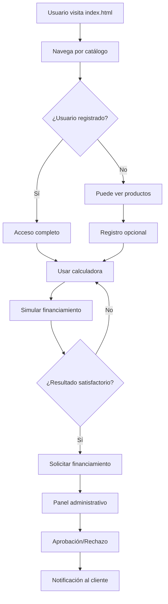
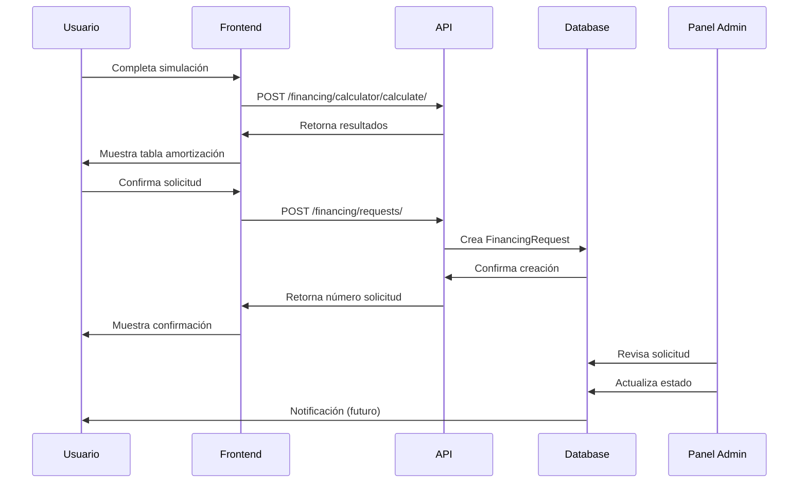
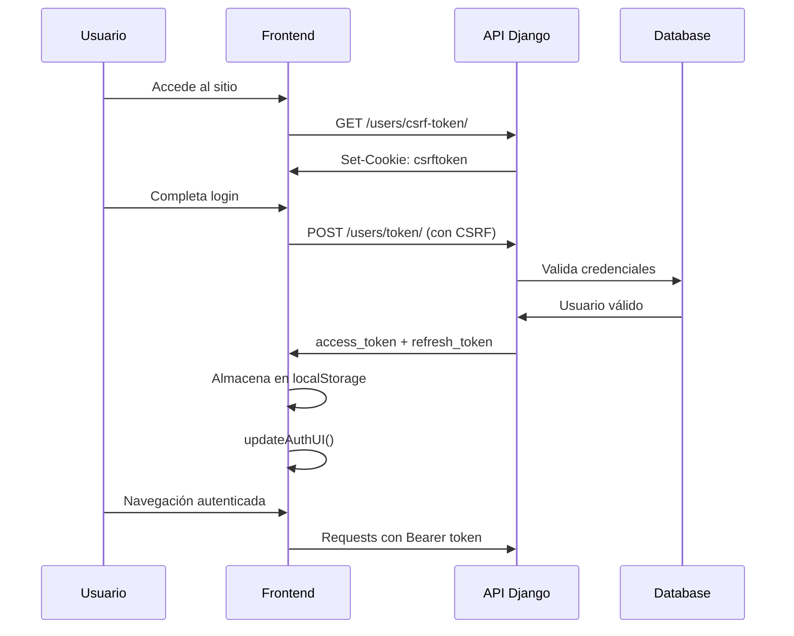

# MAPA DEL FLUJO DE PROCESOS - LLEVATELOEXPRESS.COM

## RESUMEN EJECUTIVO

LlévateloExpress es una plataforma integral de financiamiento para vehículos, motocicletas, camiones, maquinaria agrícola y equipos industriales en Venezuela. El sistema está construido con Django (backend) y JavaScript/HTML (frontend), implementando una arquitectura API REST con autenticación JWT.

**Estado actual**: Sistema operativo en producción en el VPS (fuente de verdad)
**Fecha de análisis**: Enero 2025
**Versión de Django**: 4.2.20
**Base de datos**: PostgreSQL con codificación UTF-8

---

## 1. ARQUITECTURA DEL SISTEMA

### 1.1 Estructura General
```
FRONTEND (JavaScript/HTML/CSS)
      ↕ (API REST JSON)
BACKEND (Django + DRF + SimpleJWT)
      ↕ (ORM)
BASE DE DATOS (PostgreSQL)
```

### 1.2 Componentes Principales

#### **Backend Django**
- **llevateloexpress_backend/**: Configuración principal
- **core/**: Funcionalidades centrales
- **products/**: Gestión de productos y categorías
- **financing/**: Sistema de financiamiento y simulaciones
- **users/**: Gestión de usuarios y autenticación

#### **Frontend**
- **Templates HTML**: Páginas estáticas servidas por Django
- **JavaScript modular**: auth.js, api.js, products.js
- **Bootstrap 5**: Framework CSS
- **Font Awesome**: Iconografía

#### **Infraestructura**
- **Nginx**: Servidor web y proxy reverso
- **Gunicorn**: Servidor WSGI para Python
- **PostgreSQL**: Base de datos principal
- **SSL/TLS**: Certificados de seguridad

---

## 2. FLUJO DE DATOS Y PROCESOS

### 2.1 Flujo Principal del Usuario



### 2.2 Procesos Críticos

#### **A. Autenticación de Usuario**
1. **Solicitud token CSRF**: `/api/users/csrf-token/`
2. **Registro**: `POST /api/users/register/`
3. **Login**: `POST /api/users/token/`
4. **Renovación**: `POST /api/users/token/refresh/`
5. **Perfil**: `GET /api/users/profile/`

#### **B. Gestión de Productos**
1. **Listar categorías**: `GET /api/products/categories/`
2. **Listar productos**: `GET /api/products/products/`
3. **Productos destacados**: `GET /api/products/featured-products/`
4. **Por categoría**: `GET /api/products/products-by-category/{slug}/`

#### **C. Sistema de Financiamiento**
1. **Configuración calculadora**: `GET /api/financing/calculator/config/`
2. **Cálculo simulación**: `POST /api/financing/calculator/calculate/`
3. **Crear solicitud**: `POST /api/financing/requests/`
4. **Gestión pagos**: CRUD en `/api/financing/payments/`

---

## 3. MODELO DE DATOS

### 3.1 Entidades Principales

#### **Productos**
- **Category**: id, name, slug, description, icon
- **Product**: name, category, brand, price, image, specs, features

#### **Financiamiento**
- **FinancingPlan**: name, slug, interest_rate, min/max_amount
- **FinancingRequest**: customer, product, plan, status, amounts
- **Payment**: application, type, method, amount, date
- **PaymentSchedule**: calendario de cuotas

#### **Usuarios**
- **User**: modelo estándar Django
- **Customer**: extensión con phone, address, identity_document
- **PasswordResetToken**: gestión recuperación contraseñas

### 3.2 Relaciones Clave
```
User (1) ←→ (1) Customer
Customer (1) ←→ (*) FinancingRequest
FinancingRequest (1) ←→ (*) Payment
FinancingRequest (1) ←→ (*) PaymentSchedule
Product (*) ←→ (1) Category
FinancingRequest (*) ←→ (1) Product
FinancingRequest (*) ←→ (1) FinancingPlan
```

---

## 4. API REST - ENDPOINTS COMPLETOS

### 4.1 Autenticación y Usuarios (`/api/users/`)
| Endpoint | Método | Descripción | Autenticación |
|----------|---------|-------------|---------------|
| `csrf-token/` | GET | Obtener token CSRF | No |
| `token/` | POST | Login y obtener JWT | CSRF |
| `token/refresh/` | POST | Renovar JWT | No |
| `register/` | POST | Registro de usuario | CSRF |
| `profile/` | GET | Perfil del usuario | JWT |
| `password-reset/` | POST | Solicitar reset | CSRF |
| `applications/` | GET | Solicitudes del usuario | JWT |

### 4.2 Productos (`/api/products/`)
| Endpoint | Método | Descripción | Autenticación |
|----------|---------|-------------|---------------|
| `categories/` | GET | Listar categorías | No |
| `products/` | GET | Listar productos | No |
| `products/{id}/` | GET | Detalle producto | No |
| `featured-products/` | GET | Productos destacados | No |
| `products-by-category/{slug}/` | GET | Por categoría | No |

### 4.3 Financiamiento (`/api/financing/`)
| Endpoint | Método | Descripción | Autenticación |
|----------|---------|-------------|---------------|
| `plans/` | GET | Planes disponibles | No |
| `calculator/config/` | GET | Configuración calculadora | No |
| `calculator/calculate/` | POST | Calcular financiamiento | No |
| `requests/` | POST | Crear solicitud | JWT |
| `requests/` | GET | Listar solicitudes | JWT (admin) |
| `payments/` | GET/POST | Gestión pagos | JWT |

---

## 5. FRONTEND - ESTRUCTURA Y FUNCIONALIDADES

### 5.1 Páginas Principales
- **index.html**: Página principal con hero banner, categorías, productos destacados
- **catalogo.html**: Catálogo completo con filtros
- **detalle-producto.html**: Vista detallada de productos
- **calculadora.html**: Simulador de financiamiento
- **planes.html**: Información de planes de financiamiento
- **registro.html**: Formulario de registro
- **login.html**: Formulario de inicio de sesión
- **dashboard.html**: Panel de usuario (autenticado)
- **contacto.html**: Formulario de contacto
- **nosotros.html**: Información de la empresa

### 5.2 Módulos JavaScript

#### **auth.js** - Sistema de Autenticación
```javascript
// Funciones principales
- fetchCsrfToken()
- loginUser(email, password)
- registerUser(userData)
- logoutUser()
- isAuthenticated()
- refreshAccessToken()
- authenticatedFetch(url, options)
- updateAuthUI()
```

#### **api.js** - Comunicación con API
```javascript
// Configuración base
const API_BASE_URL = '/api'

// Funciones principales
- fetchCategories()
- fetchProducts()
- fetchProductDetail(id)
- fetchFeaturedProducts()
- calculateFinancing(data)
```

#### **products.js** - Gestión de Productos
```javascript
// Funciones principales
- loadProducts(container, filters)
- renderProduct(product)
- setupFilters()
- loadProductDetails(productId)
```

### 5.3 Flujo de Interacción Frontend

1. **Carga inicial**: `auth.js` verifica estado de autenticación
2. **Actualización UI**: Muestra/oculta elementos según autenticación
3. **Navegación**: SPA-like con carga dinámica de contenido
4. **Formularios**: Validación cliente + servidor
5. **Error handling**: Mensajes específicos por operación

---

## 6. SISTEMA DE AUTENTICACIÓN

### 6.1 Arquitectura de Seguridad
```
Frontend                Backend
--------                -------
1. Solicita CSRF  →     Django middleware
2. Almacena cookie ←    Set-Cookie: csrftoken
3. Login POST     →     X-CSRFToken header
4. Recibe JWT     ←     access_token + refresh_token
5. Usa Bearer     →     Authorization header
6. Renueva auto   ←→    token/refresh/
```

### 6.2 Estados de Autenticación
- **No autenticado**: Solo lectura de productos y uso básico de calculadora
- **Autenticado**: Guardar simulaciones, crear solicitudes, acceso a dashboard
- **Expirado**: Renovación automática transparente
- **Inválido**: Logout forzado y redirección

---

## 7. CALCULADORA DE FINANCIAMIENTO

### 7.1 Modalidades Disponibles

#### **Compra Programada**
- Adjudicación al 45% del valor acumulado
- Cuota inicial fija del 5%
- Aporte inicial: 10-15% del precio
- Sin intereses

#### **Crédito Inmediato**
- Adjudicación inmediata
- Inicial: 30%, 40%, 50%, o 60%
- Plazos: 6, 12, 18, 24 meses
- Sin intereses

### 7.2 Flujo de Cálculo
1. **Selección producto**: Desde catálogo o manual
2. **Configuración**: Modalidad, inicial, plazo
3. **Cálculo**: API `/financing/calculator/calculate/`
4. **Resultados**: Tabla de amortización
5. **Guardado**: Si está autenticado
6. **Solicitud**: Conversión a aplicación formal

---

## 8. PANEL ADMINISTRATIVO

### 8.1 Funcionalidades Principales
- **Gestión productos**: CRUD completo con imágenes
- **Categorías**: Configuración y orden
- **Planes financiamiento**: Tasas y condiciones
- **Solicitudes**: Workflow de aprobación
- **Pagos**: Registro y verificación
- **Usuarios**: Gestión de clientes
- **Configuración**: Parámetros del simulador

### 8.2 Workflow de Solicitudes
```
draft → submitted → under_review → approved/rejected
                              ↓
                         documentation_required
                              ↓
                           active → completed
```

---

## 9. GESTIÓN DE ARCHIVOS ESTÁTICOS

### 9.1 Estructura de Archivos
```
static/
├── css/
│   ├── styles.css
│   └── products-smooth.css
├── js/
│   ├── auth.js
│   ├── api.js
│   ├── products.js
│   └── main.js
└── img/
    ├── banners/
    ├── partners/
    └── products/

media/
├── products/          (imágenes subidas)
├── applications/      (documentos)
└── payments/         (comprobantes)
```

### 9.2 Optimizaciones
- **Compresión**: CSS/JS minificados en producción
- **CDN**: Bootstrap y Font Awesome desde CDN
- **Caché**: Headers apropiados para archivos estáticos
- **Lazy loading**: Imágenes de productos

---

## 10. CONFIGURACIÓN DE PRODUCCIÓN

### 10.1 Variables de Entorno (`.env.production`)
```bash
DJANGO_SECRET_KEY=xxx
DJANGO_DEBUG=False
DJANGO_ALLOWED_HOSTS=llevateloexpress.com .llevateloexpress.com
DB_NAME=llevateloexpress
DB_USER=llevateloexpress_user
DB_PASSWORD=xxx
DB_HOST=localhost
DB_PORT=5432
```

### 10.2 Servicios del Sistema
- **llevateloexpress.service**: Servicio systemd para Gunicorn
- **nginx**: Configuración en `llevateloexpress_nginx.conf`
- **SSL**: Certificados Let's Encrypt
- **Logs**: Rotación automática en `/var/log/`

---

## 11. FLUJOS DE TRABAJO CRÍTICOS

### 11.1 Proceso de Solicitud de Financiamiento



### 11.2 Proceso de Autenticación



---

## 12. PROBLEMAS CONOCIDOS Y SOLUCIONES

### 12.1 Migraciones Completadas
- ✅ **Codificación UTF-8**: Base de datos migrada exitosamente
- ✅ **Autenticación**: Sistema JWT implementado
- ✅ **Frontend responsivo**: Bootstrap 5 integrado
- ✅ **API REST**: Endpoints funcionales

### 12.2 Áreas de Mejora Identificadas
- **Notificaciones**: Email automático para cambios de estado
- **Recuperación contraseña**: Sistema completo con tokens
- **Dashboard usuario**: Más funcionalidades
- **Reportes**: Panel de analytics para admin
- **Cache**: Implementar Redis para mejor performance

---

## 13. DOCUMENTACIÓN TÉCNICA DE REFERENCIA

### 13.1 Documentos Principales
- `README.md`: Introducción y configuración
- `DOCUMENTACION.md`: Índice general
- `API_DOCUMENTACION.md`: Especificación detallada de API
- `PROTOCOLOS_GIT_Y_DESPLIEGUE.md`: Procedimientos operativos

### 13.2 Scripts de Utilidad
- `deploy.sh`: Despliegue automatizado
- `backup_completo.sh`: Respaldos del sistema
- `sync_changes_production.py`: Sincronización código
- `verificar_sistema.sh`: Validación estado

---

## 14. MÉTRICAS Y MONITOREO

### 14.1 Puntos de Monitoreo
- **Disponibilidad**: Uptime del servicio web
- **Performance**: Tiempo de respuesta API
- **Errores**: Logs de Django y Nginx
- **Base de datos**: Conexiones y queries
- **Autenticación**: Intentos fallidos

### 14.2 Logs Importantes
```bash
/var/log/nginx/access.log
/var/log/nginx/error.log
/var/log/llevateloexpress/django.log
/var/log/llevateloexpress/gunicorn.log
```

---

## 15. CONCLUSIONES Y RECOMENDACIONES

### 15.1 Estado del Sistema
El sistema LlévateloExpress está **operativo y estable** en producción. La arquitectura es sólida y escalable, con separación clara entre frontend y backend. La API REST está bien documentada y el sistema de autenticación es robusto.

### 15.2 Fortalezas Identificadas
- ✅ Arquitectura modular y escalable
- ✅ Sistema de autenticación seguro (JWT + CSRF)
- ✅ API REST bien estructurada
- ✅ Frontend responsivo y moderno
- ✅ Base de datos normalizada con UTF-8
- ✅ Documentación completa y actualizada

### 15.3 Próximos Pasos Recomendados
1. **Implementar sistema de notificaciones** por email
2. **Desarrollar app móvil** usando la API existente
3. **Añadir analytics** y reportes administrativos
4. **Implementar cache** con Redis
5. **Expandir testing** automatizado
6. **Configurar backup** automatizado en cloud

---

**Fecha de elaboración**: Enero 2025  
**Elaborado por**: Análisis del sistema en producción  
**Próxima revisión**: Marzo 2025  

---

*Este documento está vivo y debe actualizarse con cada cambio significativo en el sistema.* 